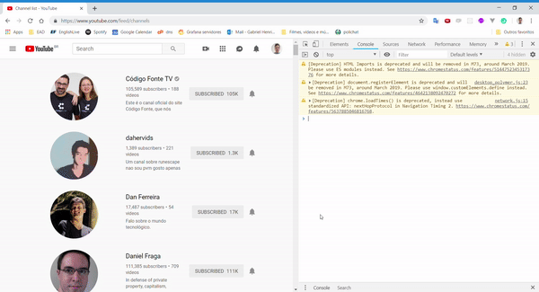

# Instagram-delete-friends-requests

Código para colar no console do google chrome para eliminar as inscrições do youtube

*TODO*
1) atualizar a lista conforme a rolagem da página. Por padrão o código só funcionará para os primeiros 100, precisa atualizar para os outros canais

Faça login no youtube e em seguida clique no link:
https://www.youtube.com/feed/channels

Abra o console do seu navegador(Se for google chrome aperte F12 e clique em console)
Cole o código do arquivo

